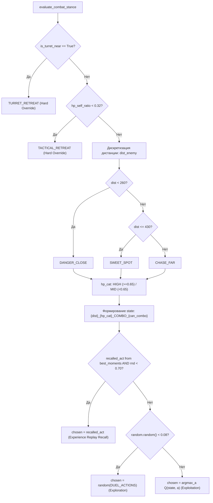
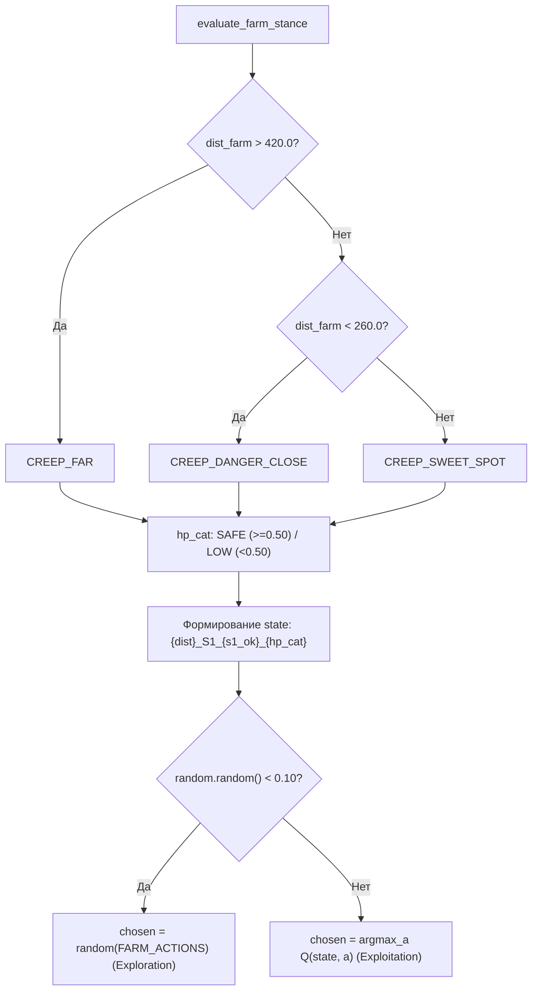
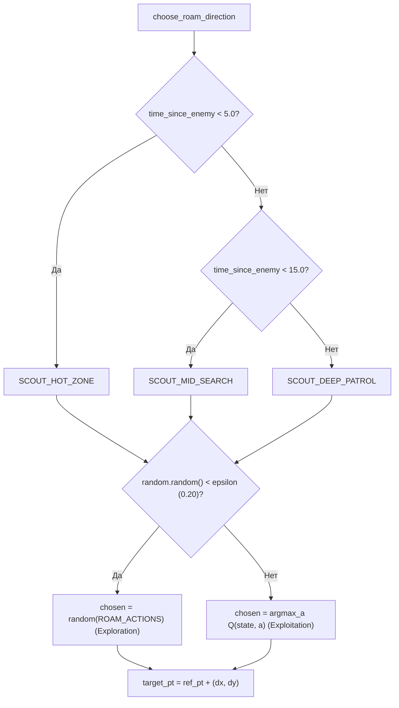

# Claude Tactical AI V2 — Инвентаризация Решений Мозга (V1 Decision Inventory)

> Документ сформирован в рамках **Этапа 14A** архитектурной миграции.  
> Представляет собой статический и динамический анализ модуля `claude_brain.py` (V1 Baseline) для проектирования модульного V2 Tactical Core без искажения существующей математики обучения с подкреплением.

---

## 1. Инвентарь Публичных Методов (Public API Inventory)

| Метод | Входные аргументы | Возврат | Читает Q | Пишет Q | Мутирует State | Побочные эффекты (I/O) | Вызовы из `realtime_vision.py` |
|---|---|---|:---:|:---:|:---:|---|:---:|
| `__init__` | `memory_file: str = "q_brain.json"`, `learning_rate=0.25`, `discount_factor=0.85`, `exploration_rate=0.20` | `None` | ❌ | ❌ | Инициализирует все таблицы и историю | Вызывает `_load_memory()` (чтение диска) | Да (инициализация в начале матча) |
| `_load_memory` | *(нет)* | `None` | ❌ | ❌ | Заполняет таблицы из JSON | Чтение файла `q_brain.json` | Да (из `__init__`) |
| `save_memory` | *(нет)* | `None` | ❌ | ❌ | ❌ | Запись файла `q_brain.json` (дамп JSON) | Да (при выходе из цикла) |
| `choose_roam_direction` | `ref_pt: Tuple[float, float]`, `time_since_enemy: float` | `Tuple[str, Tuple[int, int]]` | ✅ | ✅ *(init)* | Обновляет `last_roam_state`, `last_roam_action`, `last_roam_time`, `total_decisions`, историю | Логирует действие в историю | Да (каждые 1.2 с при разведке) |
| `reward_roam` | `reward_amount: float`, `reason: str = ""` | `None` | ✅ | ✅ | Обновляет Q-таблицу, инкрементирует `successful_learnings` | При $|R| \ge 15$ вызывает `save_memory()` | Да (при обнаружении врага, крипа, смерти, простое) |
| `penalize_wall_stuck` | `reason: str = "WALL COLLISION"` | `Tuple[int, int]` | ✅ | ✅ | Снижает Q на 25.0 | Вызывает `save_memory()` | Нет (зарезервировано в V1) |
| `get_current_roam_info` | *(нет)* | `str` | ✅ | ❌ | ❌ | ❌ | Да (для HUD) |
| `get_ai_mood` | `hp_ratio: float`, `enemy_present: bool`, `can_combo: bool`, `is_dead: bool`, `has_farm: bool` | `Tuple[str, Tuple[int, int, int]]` | ❌ | ❌ | ❌ | ❌ | Да (каждый кадр для HUD) |
| `evaluate_farm_stance` | `dist_farm: float`, `s1_ok: bool`, `hp_self_ratio: float = 1.0` | `str` | ✅ | ✅ *(init)* | Обновляет `last_farm_state`, `last_farm_action`, историю | Логирует действие в историю | Да (при наличии вражеских крипов) |
| `reward_farm` | `reward_amount: float`, `reason: str = ""` | `None` | ✅ | ✅ | Обновляет Q-таблицу | При $|R| \ge 15$ вызывает `save_memory()` | Да (при ластхите крипа, АОЕ касте) |
| `get_current_farm_info`| *(нет)* | `str` | ✅ | ❌ | ❌ | ❌ | Да (для HUD) |
| `evaluate_combat_stance`| `dist_enemy: float`, `can_combo: bool`, `is_turret_near: bool`, `hp_self_ratio: float = 1.0` | `str` | ✅ | ✅ *(init)* | Обновляет `last_combat_state`, `last_combat_action`, историю | Логирует действие в историю | Да (при обнаружении вражеского героя) |
| `reward_combat` | `reward_amount: float`, `reason: str = ""` | `None` | ✅ | ✅ | Обновляет Q-таблицу | При $|R| \ge 25$ вызывает `save_memory()` | Да (при килле, смерти, комбо, вышке) |
| `get_current_combat_info`| *(нет)* | `str` | ✅ | ❌ | ❌ | ❌ | Да (для HUD) |
| `log_action` | `category: str`, `state: str`, `action: str` | `None` | ❌ | ❌ | Добавляет запись в скользящее окно `recent_action_history` (макс. 30) | ❌ | Да (из всех evaluate методов) |
| `record_best_moment` | `moment_type: str`, `reward: float`, `description: str`, `hp_left_pct: int = 100` | `Dict` | ✅ | ✅ | Добавляет хайлайт в `best_moments`, обновляет `last_highlight_text`, **прокачивает Q-веса цепочки действий** | Вызывает `save_memory()` | Да (при килле героя, врыве с ульты) |
| `recall_best_tactic` | `current_state: str` | `Optional[str]` | ❌ | ❌ | ❌ | ❌ | Да (из `evaluate_combat_stance`) |

---

## 2. Инвентарь Решений (Decision Inventory)

Все фактически генерируемые строковые решения `ClaudeRLBrain`:

| V1 Решение | Метод генерации | Входные условия | Дополнительные условия | ActionType в V2 | Поведение в V1 `realtime_vision` |
|---|---|---|---|:---:|---|
| `TURRET_RETREAT` | `evaluate_combat_stance` | `is_turret_near == True` | Безусловный приоритет | `ActionType.RETREAT` | `joystick.kite_away(enemy_turret)` или отход назад на 180, 90 px |
| `TACTICAL_RETREAT`| `evaluate_combat_stance` | `hp_self_ratio < 0.32` | Безусловный приоритет | `ActionType.RETREAT` | `joystick.move_towards(safe_point)` + `claude_macro.panic_retreat_s2()` + хил |
| `KITE_AND_POKE` | `evaluate_combat_stance` | `dist_enemy < 260.0` (или выбор Q) | `hp >= 0.32`, `turret == False` | `ActionType.KITE` | `joystick.kite_away(best_enemy)` + S1 fast + автоатака |
| `SWEET_SPOT_BURST`| `evaluate_combat_stance`| `260.0 <= dist <= 430.0` (или выбор Q) | Оптимальная боевая зона | `ActionType.ATTACK` | Орбитальный стрейф вокруг врага по касательной + S1 + автоатака |
| `DIVE_ALL_IN` | `evaluate_combat_stance` | `SWEET_SPOT` + `can_combo` + `HIGH_HP` (или выбор Q) | Решающий врыв | `ActionType.CAST_ULT` | `claude_macro.trigger_engage_ultimate()` (полное комбо S2 $\to$ Flicker $\to$ Ult $\to$ S1) |
| `FARM_APPROACH` | `evaluate_farm_stance` | `dist_farm > 420.0` (или выбор Q) | Крип далеко | `ActionType.MOVE` | `joystick.move_towards(best_farm)` + автоатака |
| `FARM_KITE_BACK` | `evaluate_farm_stance` | `dist_farm < 260.0` (или выбор Q) | Опасное сближение с крипом | `ActionType.KITE` | `joystick.kite_away(best_farm)` + автоатака |
| `FARM_SWEET_SPOT` | `evaluate_farm_stance` | `260.0 <= dist <= 420.0` (или выбор Q) | Оптимальная дистанция фарма | `ActionType.FARM` | Орб-вокинг вокруг пачки крипов + автоатака |
| `FARM_S1_AOE` | `evaluate_farm_stance` | `SWEET_SPOT` + `s1_ok` (или выбор Q) | АОЕ зачистка пачки | `ActionType.CAST_S1` | `claude_macro.fire_skill_1_fast()` + автоатака |
| `LANE_ADVANCE` | `choose_roam_direction` | Разведка Q-выбор | `dx: 230, dy: -60` | `ActionType.SCOUT` | Бег по линии прямо |
| `LANE_PUSH` | `choose_roam_direction` | Разведка Q-выбор | `dx: 190, dy: -20` | `ActionType.SCOUT` | Пуш линии вперед |
| `RIVER_SCOUT` | `choose_roam_direction` | Разведка Q-выбор | `dx: 130, dy: 90` | `ActionType.SCOUT` | Контроль реки и центра |
| `FLANK_ADVANCE` | `choose_roam_direction` | Разведка Q-выбор | `dx: 110, dy: -130`| `ActionType.SCOUT` | Обход по верхнему флангу |
| `CREEP_INTERCEPT`| `choose_roam_direction` | Разведка Q-выбор | `dx: 160, dy: 40` | `ActionType.SCOUT` | Перехват крипов снизу |

---

## 3. Деревья Принятия Решений (Decision Trees)

### 3.1. Боевое Дерево (`evaluate_combat_stance`)


### 3.2. Дерево Фарма Крипов (`evaluate_farm_stance`)


### 3.3. Дерево Разведки (`choose_roam_direction`)


---

## 4. Границы Q-Learning и Математика (Q-Learning Boundary)

В V1 модуле код разделен на 5 фундаментальных аспектов:

### 4.1. READ ONLY (Чтение опыта)
- `recall_best_tactic(current_state)`: просматривает последние 10 записей `best_moments` без модификации.
- `get_current_roam_info()`, `get_current_farm_info()`, `get_current_combat_info()`: чтение текущего Q-значения для отрисовки HUD.
- `choose_roam_direction` / `evaluate_*`: чтение `argmax_a Q(s, a)` для выбора действия при эксплуатации.

### 4.2. LEARNING (Формулы обновления весов)
Математическое ядро обучения V1:
1. **Основное обновление (Exponential Moving Average / Q-learning):**
   $$Q(s, a) \leftarrow Q(s, a) + \alpha \cdot [R - Q(s, a)]$$
   где $\alpha = 0.25$ (`learning_rate`).
   *Архитектурное наблюдение:* Параметр `gamma` ($\gamma = 0.85$, discount factor) объявлен в конструкторе, но в формулах **не используется**, то есть алгоритм фактически работает как Contextual Bandit / 1-step Q-learning без дисконтирования будущего состояния $\max_{a'} Q(s', a')$.
2. **Experience Replay Boost (в `record_best_moment`):**
   $$Q(s, a) \leftarrow Q(s, a) + 0.35 \cdot [R_{moment} - Q(s, a)]$$
   Ретроактивно применяется к последним 6 действиям за 8 секунд.

### 4.3. MEMORY (Хранилище)
- Файл: `q_brain.json`.
- Структура:
  ```json
  {
    "roam_q": { "<state>": { "<action>": 0.0 } },
    "farm_q": { "<state>": { "<action>": 0.0 } },
    "combat_q": { "<state>": { "<action>": 0.0 } },
    "best_moments": [ { "id": 1, "type": "SOLO_KILL", "reward": 60, "actions": [...] } ],
    "total_decisions": 120,
    "saved_at": "2026-09-06 05:00:00"
  }
  ```
- Ограничение: хранится топ-50 лучших моментов (`self.best_moments[-50:]`).

### 4.4. REWARD (Источники подкрепления из `realtime_vision.py`)
- Убийство врага: `reward_combat(+60.0)`, `reward_roam(+40.0)`, `record_best_moment(SOLO_KILL, +60.0)`.
- Смерть Клода: `reward_combat(-40.0)`, `reward_roam(-30.0)`.
- Добивание крипа: `reward_farm(+25.0)`, `reward_roam(+15.0)`.
- Первый контакт с врагом на разведке: `reward_roam(+30.0)`.
- Заход под вышку врага: `reward_combat(-40.0)`.
- Успешный врыв с ульты: `reward_combat(+35.0)`, `record_best_moment(BURST_COMBO, +35.0)`.
- Зачистка пачки крипов через S1: `reward_farm(+20.0)`.
- Застревание в стене: `penalize_wall_stuck(-25.0)`.
- Блуждание без дела > 25 сек: `reward_roam(-3.0)`.

### 4.5. DECISION (Выбор действий)
- Epsilon-Greedy политика:
  - Разведка: $\epsilon = 0.20$ (из `self.epsilon`).
  - Фарм: $\epsilon = 0.10$ (жестко зашит `random.random() < 0.10`).
  - Бой: $\epsilon = 0.08$ (жестко зашит `random.random() < 0.08`).
  - Приоритет воспоминаний (Recall): с вероятностью $70\%$ выбирает тактику из триумфов.

---

## 5. Побочные Эффекты (Side Effects)

| Метод | Побочный эффект | Причина существования в V1 | Целевой слой в V2 |
|---|---|---|---|
| `evaluate_*` | Запись дефолтных Q-значений в `q_table` при первом посещении состояния | Отсутствие явной фазы инициализации состояний | `brain.q_learning` |
| `evaluate_*` | Мутация `last_*_state` и `last_*_action` на экземпляре класса | Передача контекста в последующий `reward_*` | `brain.state` / `brain.tactical` |
| `log_action` | Добавление словаря в `recent_action_history` | Построение цепочки для Experience Replay | `brain.memory` |
| `record_best_moment` | Ретроактивная перезапись Q-весов в трёх Q-таблицах одновременно | Поощрение всей цепочки решений перед триумфом | `brain.memory` + `brain.rewards` |
| `reward_*` | Вызов `save_memory()` и запись `q_brain.json` на диск при больших наградах | Сохранение прогресса при критических событиях | `brain.memory` |

---

## 6. Зависимости (Dependencies)

- **Стандартная библиотека:** `os`, `sys`, `json`, `time`, `random`, `typing.Tuple`, `typing.Dict`, `typing.List`, `typing.Optional`.
- **Зависимости от `config.config`:** отсутствуют (в V1 `claude_brain.py` был полностью автономен, параметры задавались по умолчанию).
- **Специфика ОС:** переконфигурация потоков `sys.stdout` / `sys.stderr` на UTF-8 для платформы Windows.
- **Внешние runtime-зависимости:** модуль не зависит от OpenCV, YOLO, ADB или драйверов.

---

## 7. Граф Вызовов Runtime (`realtime_vision.py` $\to$ Brain)

```
Кадр видеопотока (realtime_vision.py loop)
   │
   ├── 1. Сенсорный анализ (YOLO + оптические детекторы)
   │
   ├── 2. Оценка событий (Game Events)
   │      ├── Враг убит   ──> rl_brain.reward_combat(60) & reward_roam(40) & record_best_moment()
   │      ├── Клод погиб  ──> rl_brain.reward_combat(-40) & reward_roam(-30)
   │      └── Крип добит  ──> rl_brain.reward_farm(25) & reward_roam(15)
   │
   ├── 3. Запрос HUD состояния
   │      └── rl_brain.get_ai_mood(hp, enemy, combo, is_dead, farm)
   │
   ├── 4. Принятие тактического решения (Ветвление)
   │      ├── Враг на экране?
   │      │     └── rl_brain.evaluate_combat_stance(dist, combo, turret, hp)
   │      │           ├── TURRET_RETREAT   ──> rl_brain.reward_combat(-40) & joystick.kite_away()
   │      │           ├── TACTICAL_RETREAT ──> safe move & panic_retreat_s2()
   │      │           ├── KITE_AND_POKE    ──> kite move & S1 & attack
   │      │           ├── SWEET_SPOT_BURST ──> strafe move & S1 & attack
   │      │           └── DIVE_ALL_IN      ──> macro.trigger_engage_ultimate() & reward_combat(35)
   │      │
   │      ├── Нет врага, но есть крипы?
   │      │     └── rl_brain.evaluate_farm_stance(dist, s1_ok, hp)
   │      │           ├── FARM_APPROACH    ──> move & attack
   │      │           ├── FARM_KITE_BACK   ──> kite & attack
   │      │           ├── FARM_S1_AOE      ──> S1 cast & reward_farm(20) & attack
   │      │           └── FARM_SWEET_SPOT  ──> orb-walk move & attack
   │      │
   │      └── Поле чистое? (Разведка)
   │            └── rl_brain.choose_roam_direction(ref_pt, time_since_enemy)
   │                  └── joystick.move_towards(current_roam_target)
   │
   └── 5. Завершение матча / остановка бота
          └── rl_brain.save_memory()
```

---

## 8. Архитектурное Разделение на Модули V2 (V2 Mapping Proposal)

В ходе последующих этапов монолитный `ClaudeRLBrain` будет декомпозирован на 4 однонаправленных компонента без изменения алгоритмов:

```
brain/
├── tactical.py      # Чистый контракт TacticalBrain: WorldState -> Action
├── state.py         # Извлечение признаков: TacticalStateBuilder (создан на шаге 13C)
├── v1_adapter.py    # Адаптер вызовов V1: V1BrainAdapter (создан на шаге 13B)
├── q_learning.py    # Математика Q-обучения (таблицы roam_q, farm_q, combat_q, формула Беллмана, эпсилон-политика)
├── rewards.py       # Расчет наград по игровым событиям (GameEvent -> float reward)
└── memory.py        # I/O JSON, Experience Replay буфер, банк лучших моментов
```

---

## 9. Критические Наблюдения и Скрытые Зависимости (Critical Findings)

1. **Смешение чтения и записи при принятии решения:**  
   Методы `evaluate_combat_stance`, `evaluate_farm_stance`, `choose_roam_direction` не являются "чистыми функциями". Если встречаемое состояние отсутствует в словаре, они немедленно инициализируют его и мутируют Q-таблицу.
2. **Смешение Reward, Memory и Decision в `record_best_moment`:**  
   Метод `record_best_moment` не просто сохраняет хайлайт в JSON: он выполняет ретроактивный **Experience Replay**, напрямую перезаписывая веса в трёх Q-таблицах для действий за последние 8 секунд.
3. **Несоответствие параметра `gamma`:**  
   Атрибут `self.gamma = 0.85` никогда не используется в обновлениях Q-весов. Формула обучения в V1 является формулой скользящей средней с шагом $\alpha = 0.25$.
4. **Несоответствие $\epsilon$ (Exploration):**  
   В конструкторе задается `exploration_rate = 0.20`. Однако метод `evaluate_farm_stance` использует жестко зашитую вероятность $10\%$, а `evaluate_combat_stance` — $8\%$. Параметр `self.epsilon` используется только в `choose_roam_direction`.
5. **Мутабельный контекст состояния:**  
   Свойства `self.last_combat_state` и `self.last_combat_action` перезаписываются при каждом вызове. Если между решением и наградой проходит несколько кадров, награда начисляется самому последнему вычисленному действию, а не исходному.
6. **Полнота данных `WorldState`:**  
   Все признаки, необходимые для работы V1 (`dist_enemy`, `dist_farm`, `hp_ratio`, `can_combo`, `s1_ready`, `is_turret_near`), полностью и безопасно извлекаются из V2 `WorldState` через `TacticalStateBuilder` без необходимости каких-либо хаков или недостающих данных.
